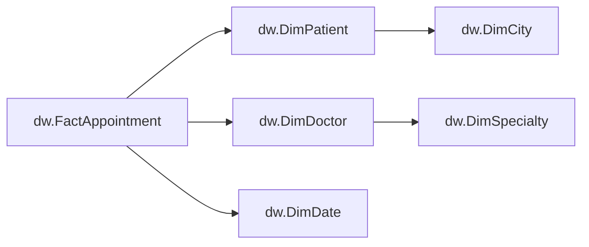
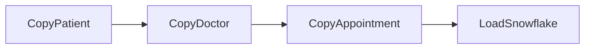

# Diamond snowflake warehouse and ADF pipeline

Server: `diamond-clinical-91685bfa.database.windows.net`  
Resource group: `DiamondResourceGroup`  
Source database: `Diamond02`  
Warehouse database: `DiamondWarehouse`  
Data Factory: `adf-diamond-clinical-91685bfa`  
Published pipeline: `PL_DiamondSnowflake`

This is a snowflake dimensional model in Azure SQL, not the Snowflake cloud product.



City and specialty attributes were moved into referenced dimensions. Existing patient, doctor and appointment keys were preserved. `dw.vAppointmentDetails` provides flattened reporting access.



Each copy reads its source table in Diamond02 and replaces its corresponding `stg` table in DiamondWarehouse. Copy retries reset that staging table before inserting. After all three copies succeed, `dw.LoadAppointments` validates copied row counts and references, loads the dimensions and facts, and writes `etl.LoadAudit` in one transaction. Failed copy activities cannot start the warehouse load; ADF Monitor records activity failures. Staging may contain partial data after a failure; rerun the entire pipeline to refresh all staging tables.

The pipeline allows one concurrent run and uses shared staging tables. Use only this pipeline to write staging, and rerun the entire pipeline rather than individual activities. The earlier `run-diamond-warehouse.py` loader is disabled for this schema. Source tables are read in separate activities, not one cross-table snapshot: use a stable source period for a consistent business snapshot. References are validated, but this does not guarantee a point-in-time snapshot during concurrent source changes.

Dimensions use Type 1 overwrites. Facts are updated/inserted by AppointmentId; no source-delete propagation is implemented. DimDate contains appointment dates, not a continuous calendar. CostGBP represents appointment amounts across all statuses, not collected revenue.

ADF authenticates with its system-assigned managed identity. It has SELECT on the three source tables, SELECT and INSERT on the three staging tables (the SQL copy connector requires target read access), and EXECUTE on their reset and warehouse load procedures. No password is stored. The SQL firewall includes `AllowAzureServicesDemo` (0.0.0.0), permitting Azure-origin network connections while still requiring database authentication. This demo uses public Azure integration runtime connectivity, not private endpoints. The existing client-IP rule remains available for administrator queries.

The pipeline is published with manual execution and no scheduled trigger. Run in ADF Studio: Author -> Pipelines -> PL_DiamondSnowflake -> Trigger now. View results under Monitor -> Pipeline runs.

From this workspace:

```powershell
python patient-adf/run-diamond-pipeline.py
python patient-adf/run-diamond-pipeline.py status <run-id>
python patient-adf/verify-diamond-snowflake.py
```

Query DiamondWarehouse:

```sql
SELECT * FROM dw.vAppointmentDetails ORDER BY AppointmentId;
SELECT * FROM etl.LoadAudit ORDER BY LoadedAtUtc DESC;
```

Implementation files:

- `build-snowflake.py`: generates migration and ARM template.
- `sql/07-diamond-snowflake.sql`: migration, loader, staging-reset procedures and reporting view.
- `deploy-snowflake.py`: applies migration transactionally, checking preservation of existing fact keys and amounts.
- `diamond-adf.json`: published linked services, datasets and pipeline.
- `configure-diamond-adf.py`: managed-identity SQL permissions.
- `verify-diamond-snowflake.py`: checks all source values against warehouse joins and the five foreign-key relationships; optional `--test-rollback` exercises invalid-reference rollback while the pipeline is idle.

Azure SQL Basic databases and ADF executions are billed resources.

## Live verification (2026-09-11)

Both full pipeline runs succeeded:

- `8b16442b-52fd-4763-8569-94ae6de76108` (the first patient-copy attempts exposed a missing target SELECT permission; fixed before the successful retry).
- `d3c38368-7981-45ff-9446-a9414347184f` (repeat run after the permission fix).

Each run copied 6 patients, 3 doctors and 8 appointments and wrote a successful audit record with GBP 585 in appointment amounts. Final dimensions contain 6 cities, 3 specialties, 6 patients, 3 doctors and 8 dates, with 8 appointment facts. Live source-to-warehouse value comparisons and all five trusted foreign-key relationships passed. An invalid staging patient reference was rejected, and the test confirmed rollback of the staging change with unchanged facts.

Connector reference: [Microsoft Azure SQL connector](https://learn.microsoft.com/en-us/azure/data-factory/connector-azure-sql-database).
