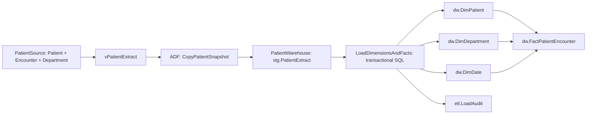

# Patient source to warehouse with Azure Data Factory

For the live Diamond02 source, snowflake warehouse and deployed ADF pipeline, see [DiamondSnowflake.md](DiamondSnowflake.md). The original PatientSource/Encounter template documented below is a separate local demo.

Three additional read-only learning pipelines are documented in [SimplePipelines.md](SimplePipelines.md).

For a local SSIS learning package and interactive visual preview, see [ssis-learning/README.md](ssis-learning/README.md).

Prepared locally; **not deployed or executed in Azure**. Azure authentication and a target subscription/resource group are still required. SQL runtime tests have not run: this workspace has no SQL Server engine or Azure connection.

The package provisions a new Azure SQL logical server, two Basic databases and an ADF factory with a manual pipeline. Use new resource names. This implementation uses Azure SQL as a small relational warehouse; it is not a Fabric or Synapse warehouse.



| Table | Meaning |
|---|---|
| `dbo.Patient` in source | Four synthetic patients; one has no visits |
| `dbo.Encounter` in source | Four visits with department, visit date and cost in GBP |
| `dw.DimPatient` | One current record per patient with a stable surrogate key |
| `dw.DimDepartment` | One current record per department |
| `dw.DimDate` | One record per encountered calendar date; date key YYYYMMDD |
| `dw.FactPatientEncounter` | Exactly one row per encounter; measures are encounter count and cost in GBP |
| `etl.LoadAudit` | Successful run ID, timestamp, extracted rows, patients, encounters and cost |

Patient attributes alone are descriptive; the added encounter source supplies meaningful fact measures. The left join retains patients without visits without inventing fact rows. Initial result: **4 patients, 2 departments, 3 dates, 4 facts, GBP 770**; the flat extract contains 5 rows.

## Load behavior

Full extract, explicit column mappings, no partitioned reads, and a single concurrent pipeline run. Each copy attempt resets staging before inserting. A failed copy cannot start the warehouse procedure. The procedure validates row counts, duplicate encounters, dates and consistent attributes; all dimension/fact updates and the successful audit record commit together. A failed procedure rolls back changes and fails the ADF activity. ADF Monitor records failed runs.

Dimension changes use **Type 1** (overwrite current attributes). Facts use the source encounter ID to update existing rows or insert new rows, so reruns do not duplicate facts. Source deletes are not propagated; this example retains historical warehouse rows. Empty extracts fail intentionally. There is no incremental watermark, historical Type 2 tracking, deletion handling, continuous date spine or scheduled trigger in this demo. Run only this pipeline against its shared staging table.

## Deploy and initialise

1. Install Azure CLI and sign in with `az login`. Select the intended subscription with `az account set --subscription '<subscription-id>'`. The deploying identity needs permission to provision SQL and Data Factory resources.
2. Copy `azuredeploy.parameters.example.json` to a local parameters file. Supply globally unique SQL server and factory names, your Entra administrator display name/object ID, region and public IPv4. The source and warehouse database names must differ. The selected SQL administrator must be able to create the factory's contained database user.
3. Choose connectivity. The default parameter `allowAzureServices=false` leaves the public Azure integration runtime blocked. For this synthetic demo, setting it to `true` creates Azure SQL's Azure-services firewall rule; that rule permits Azure-origin network traffic but still requires database authentication. Otherwise configure a private/self-hosted integration runtime and its SQL network access before running. The template does not provision private endpoints. The operator IPv4 rule permits initial SQL setup.
4. From this folder, validate and preview the resources, then deploy:

   ```powershell
   az deployment group validate --resource-group '<resource-group>' --template-file azuredeploy.json --parameters '@azuredeploy.parameters.local.json'
   az deployment group what-if --resource-group '<resource-group>' --template-file azuredeploy.json --parameters '@azuredeploy.parameters.local.json'
   az deployment group create --resource-group '<resource-group>' --name patient-warehouse --template-file azuredeploy.json --parameters '@azuredeploy.parameters.local.json'
   ```

   The resource group must already exist. The deployment creates two billed Basic SQL databases; ADF execution is also billed. It creates no schedule. No resources have been created by preparing these files.
5. Connect in SSMS using Microsoft Entra authentication as the configured SQL administrator. Run `sql/01-source.sql` against **PatientSource**, then `sql/02-warehouse.sql` against **PatientWarehouse**. These scripts create tables and procedures; ARM deployment alone does not execute them.
6. Enable SQLCMD mode in SSMS, replace the factory name in `sql/03-adf-access.sql`, and run it in **both** databases. The factory gets SELECT on the source view, INSERT on staging, and EXECUTE on the two warehouse procedures. There are no embedded passwords.
7. In ADF Studio, test both linked-service connections. Open **PL_PatientWarehouse** and select **Trigger now**. Inspect CopyPatientSnapshot and LoadDimensionsAndFacts in Monitor.
8. Run `sql/04-validate.sql` in PatientWarehouse. Run the pipeline a second time and repeat the validation: table counts and total cost must stay unchanged, with a new audit record.

## Local verification

```powershell
node build-template.cjs
node validate.cjs
```

These checks inspect JSON, resource dependencies, mappings, sequencing and safety settings; they do not replace Azure ARM validation or execution of the SQL and ADF tests. Edit `build-template.cjs`, then regenerate `azuredeploy.json` when changing infrastructure or pipeline definitions.

Microsoft references: [Azure SQL connector and managed identity](https://learn.microsoft.com/en-us/azure/data-factory/connector-azure-sql-database), [Stored Procedure activity](https://learn.microsoft.com/en-us/azure/data-factory/transform-data-using-stored-procedure), [SQL server ARM properties](https://learn.microsoft.com/en-us/azure/templates/microsoft.sql/2023-08-01/servers).
