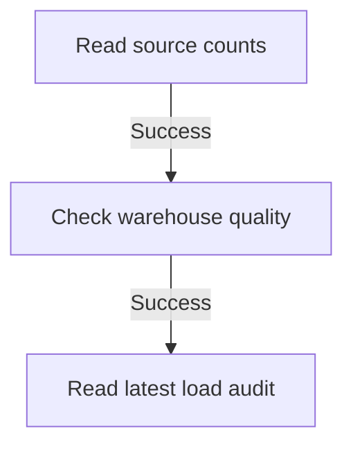

# Diamond SSIS learning package

Open **preview.html** in your browser to explore the package visually. It is an interactive illustration, not a screenshot of Visual Studio or a live execution environment. Click a task to inspect its SQL, connection manager and variable. **Simulate next task** only advances the illustration.

`Diamond_SSIS_Learning.dtsx` is a generated native SSIS package definition with three Execute SQL tasks. It is a read-only Control Flow example, not a data-copy ETL package. It has not been imported, validated or executed by an SSIS runtime because the machine currently has Build Tools but no installed Visual Studio SSIS designer/runtime. Microsoft OLE DB Driver 19 is present.

| Task | Connection | Output variable |
|---|---|---|
| Read source counts | CM_Diamond02 | User::SourceSummary |
| Check warehouse quality | CM_DiamondWarehouse | User::QualitySummary |
| Read latest load audit | CM_DiamondWarehouse | User::LatestLoadSummary |

Each task returns one string column, configured as **Single row**, with result ordinal **0** mapped to its package variable. Tasks are joined by success-only precedence constraints. A SQL exception fails the task and prevents downstream tasks from starting.

## Open in the real SSIS designer

1. Install a supported Visual Studio edition and the [Microsoft SQL Server Integration Services Projects extension](https://marketplace.visualstudio.com/items?itemName=SSIS.MicrosoftDataToolsIntegrationServices). Check its current Visual Studio compatibility before installation.
2. Create an **Integration Services Project**.
3. Right-click **SSIS Packages -> Add Existing Package**. Choose **File System** and select `Diamond_SSIS_Learning.dtsx`.
4. Open the package's **Control Flow** tab. If the nodes overlap, select them and use the designer's Auto Layout command. The generated file does not include saved designer coordinates.
5. In **Connection Managers**, configure and test both OLE DB connections. They point to `diamond-clinical-91685bfa.database.windows.net`, databases `Diamond02` and `DiamondWarehouse`, using Microsoft OLE DB Driver 19 and interactive Microsoft Entra authentication. Replace the user ID if necessary. The driver may prompt for sign-in and does not reuse Azure CLI credentials.
6. To inspect output values, set an **OnPostExecute** breakpoint on a task using **Edit Breakpoints**, run the package, and inspect its `User::` variable in the Locals or Watch window while paused.

The signed-in identity must have SELECT on the source tables and warehouse audit table, and EXECUTE on `etl.CheckWarehouseQuality`. The existing SQL administrator can perform this exercise. SQL firewall access must allow the client connection. No password is saved (`DontSaveSensitive` protection level). Interactive authentication is for desktop learning, not unattended execution.

## How Data Flow differs

This first package intentionally contains only Execute SQL tasks. The **Data Flow explained** tab in the preview illustrates a future ETL exercise:

`OLE DB Source -> Derived Column / Data Conversion -> OLE DB Destination`

Those components operate on rows inside a Data Flow task. After a copy, an Execute SQL task can run the warehouse load procedure. A future writing exercise should use a dedicated staging area; do not share the live `stg` tables with the ADF pipeline because independent runtimes could overwrite each other's staging data.

## What was verified

- The package XML parses, with three tasks, two success constraints, two connections and three output variables.
- All three embedded SQL statements were executed through the existing Python SQL connection against Azure on 2026-09-12. Each returned the expected single string column. Source counts were 6 patients, 3 doctors and 8 appointments; warehouse validation passed with GBP 585 in appointment amounts.
- Preview task selection, tabs, simulation completion and reset passed browser checks with no JavaScript errors.
- These checks do **not** validate SSIS deserialization, OLE DB result mapping, designer rendering or runtime execution. Those require opening and running the package in the SSIS designer.

No SSIS Azure runtime, SSISDB catalog or ADF Execute SSIS Package activity has been created. No live patient records or staging tables were changed.

Regenerate the package and preview data using `python patient-adf/ssis-learning/build_package.py` from the workspace root.

References: [SSIS projects and solutions](https://learn.microsoft.com/en-us/sql/integration-services/integration-services-ssis-projects-and-solutions), [SQL task package schema](https://learn.microsoft.com/en-us/openspecs/sql_data_portability/ms-dtsx2/5a9acda7-eb78-4b58-b281-6108b87f996e), [Microsoft Entra authentication in OLE DB](https://learn.microsoft.com/en-us/sql/connect/oledb/features/using-azure-active-directory).
